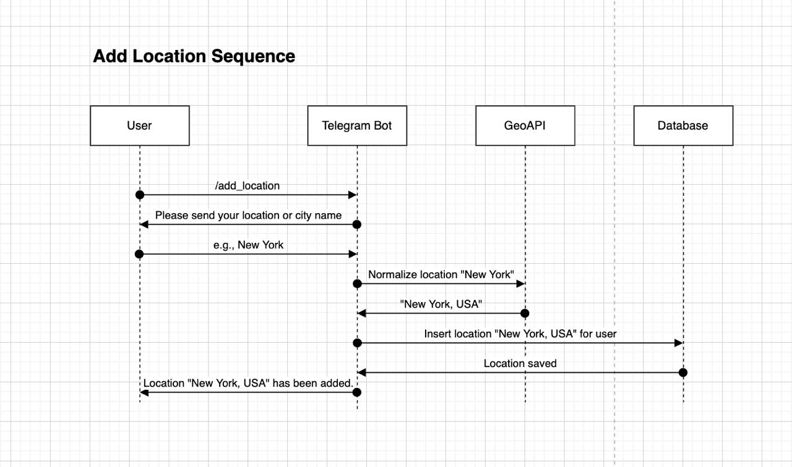
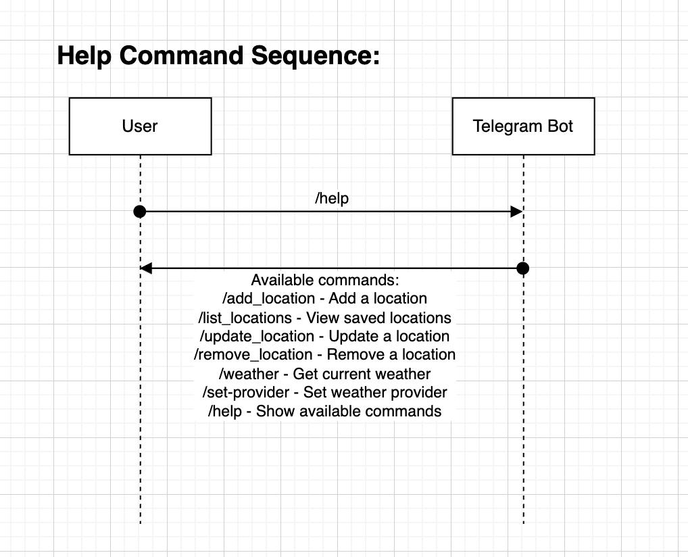
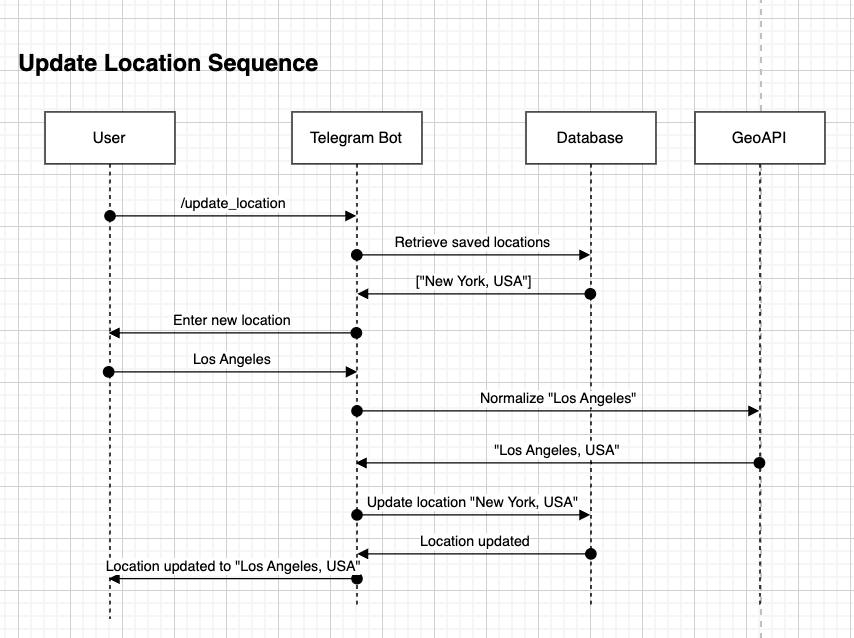
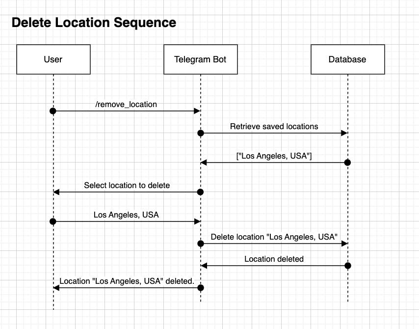
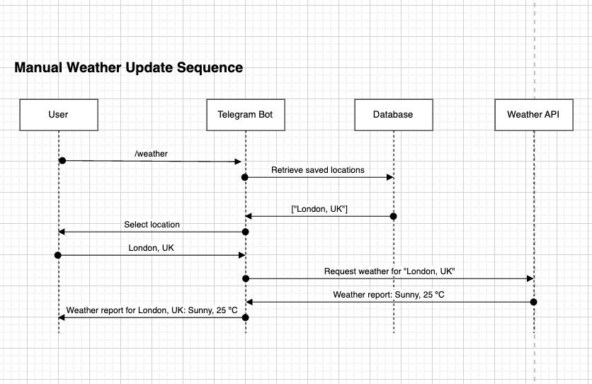
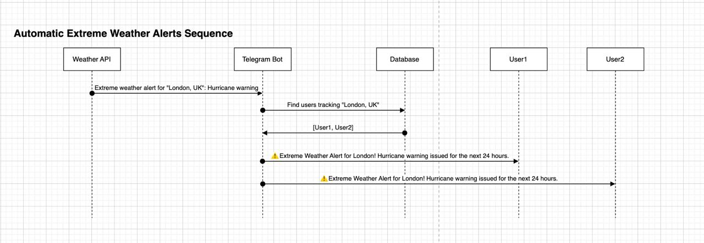
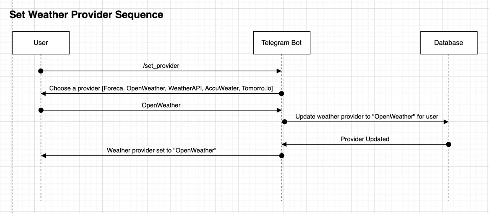

<p align="center">
  
</p>

<h1 align="center">Weather Alerts Bot</h1>

<p align="center">
  <b>Real-time weather updates and critical alerts via Telegram.</b><br />
  <a href="https://your-weather-bot-website.example">https://your-weather-bot-website.example</a>
</p>

---

<!-- Optionally, you can add badges here if you want -->
<p align="center">
  
  
  
  
  
  
</p>

---

# Weather Alerts Bot
Stay updated with real-time weather alerts

**Table of Contents**

1. [Introduction](#introduction)  
2. [Features & Functionality](#features--functionality)  
   - [User Interaction](#user-interaction)  
   - [User Requirements](#user-requirements)  
   - [Commands & User Actions](#commands--user-actions)  
3. [Sequence Diagrams](#sequence-diagrams)  
   - [1. Add Location Sequence](#1-add-location-sequence)  
   - [2. View Saved Locations Sequence](#2-view-saved-locations-sequence)  
   - [3. Update Location Sequence](#3-update-location-sequence)  
   - [4. Delete Location Sequence](#4-delete-location-sequence)  
   - [5. Manual Weather Update Sequence](#5-manual-weather-update-sequence)  
   - [6. Automatic Extreme Weather Alerts Sequence](#6-automatic-extreme-weather-alerts-sequence)  
   - [7. Set Weather Provider Sequence](#7-set-weather-provider-sequence)  
   - [8. Help Command Sequence](#8-help-command-sequence)  
4. [Data Sources & Weather Providers](#data-sources--weather-providers)  
5. [Authentication & User Data Storage](#authentication--user-data-storage)  
6. [Localization & Language](#localization--language)  
7. [Performance & Scalability](#performance--scalability)  
8. [Security & Compliance](#security--compliance)  
9. [Hosting & Reliability](#hosting--reliability)  
10. [Deployment](#deployment)  
    - [1. Prerequisites](#1-prerequisites)  
    - [2. Environment Variables](#2-environment-variables)  
    - [3. Local Development (Optional)](#3-local-development-optional)  
    - [4. Deploying on Render](#4-deploying-on-render)  
    - [5. Testing & Verification](#5-testing--verification)  
    - [6. Logging & Monitoring](#6-logging--monitoring)  
    - [7. Scaling & Service Plans](#7-scaling--service-plans)  
11. [Conclusion](#conclusion)

---

## Introduction

The **Weather Alerts Bot** is an MVP designed to provide users with real-time weather updates and extreme weather alerts through Telegram. Users can add and manage locations, request weather updates manually, and receive automatic notifications for critical weather conditions. While this product is initially scoped as an MVP, it should be robust enough for production-level maintainability, scalability, and reliability.

---

## Features & Functionality

### User Interaction

- The bot operates entirely through **Telegram** text commands and interactive buttons.  
- Responses to users are **text-based messages** and can include emojis, alerts, and formatted information.

### User Requirements

1. **Add locations** for weather tracking.  
2. **View** a list of saved locations.  
3. **Update** previously saved locations.  
4. **Delete** saved locations.  
5. **Request** current weather updates for any of the saved locations.  
6. **Receive** automatic extreme weather alerts.

### Commands & User Actions

Below are the primary commands the bot will recognize. For a full list, see the [/help](#8-help-command-sequence) command.

1. **/add_location** – Allows the user to add a new location to track.  
   - The bot uses a GeoAPI to validate the location and normalize city names.  
2. **/list_locations** – Displays the user’s currently saved locations.  
3. **/update_location** – Lets the user update one of their saved locations.  
4. **/remove_location** – Removes a selected saved location.  
5. **/weather** – Prompts the user to select a location and returns the current weather.  
6. **/set_provider** – Allows the user to choose which weather data provider to use (e.g., Foreca, OpenWeather, etc.).  
7. **/help** – Shows a list of available commands and how to use them.

---

## Sequence Diagrams

Below are references to sequence diagrams illustrating the main flows. You can place the actual image files in a `docs/` folder or embed them directly in Markdown if supported by your platform.

### 1. Add Location Sequence



<details>

<summary>Process</summary>

1. **User** sends `/add_location`.  
2. **Telegram Bot** asks for the city or gets a shared location.  
3. **Telegram Bot** calls **GeoAPI** to normalize the location.  
4. **Telegram Bot** stores the normalized location in **Database**.  
5. **Telegram Bot** confirms the addition to the user.

</details>

### 2. View Saved Locations Sequence



<details>

<summary>Process</summary>

1. **User** sends `/list_locations`.  
2. **Telegram Bot** retrieves the user’s saved locations from **Database**.  
3. **Telegram Bot** returns the list of locations (e.g., “1. New York, USA\n2. London, UK”).

</details>

### 3. Update Location Sequence



<details>

<summary>Process</summary>

1. **User** sends `/update_location`.  
2. **Telegram Bot** retrieves saved locations from **Database** and displays them for selection.  
3. **User** selects a location and enters a new city name.  
4. **Telegram Bot** calls **GeoAPI** to normalize the new location.  
5. **Telegram Bot** updates the location in **Database**.  
6. **Telegram Bot** confirms the update to the user.

</details>

### 4. Delete Location Sequence



<details>

<summary>Process</summary>

1. **User** sends `/remove_location`.  
2. **Telegram Bot** retrieves saved locations from **Database**.  
3. **User** selects which location to remove.  
4. **Telegram Bot** confirms deletion with the user.  
5. **Telegram Bot** deletes the location in **Database**.  
6. **Telegram Bot** notifies the user that the location was removed.

</details>

### 5. Manual Weather Update Sequence



<details>
<summary>Process</summary>

1. **User** sends `/weather`.  
2. **Telegram Bot** fetches saved locations from **Database** and prompts the user to pick one.  
3. **User** selects a location.  
4. **Telegram Bot** requests current weather from **Weather API** (based on user’s provider or default).  
5. **Weather API** returns data to **Telegram Bot**.  
6. **Telegram Bot** sends the weather report to the user.

</details>

### 6. Automatic Extreme Weather Alerts Sequence



<details>
<summary>Process</summary>

1. **Weather API** triggers an extreme weather alert for a location (e.g., “London, UK”).  
2. **Telegram Bot** checks **Database** for all users who track that location.  
3. **Telegram Bot** sends an alert message (e.g., “⚠️ Extreme Weather Alert: Hurricane warning!”) to each affected user.

</details>

### 7. Set Weather Provider Sequence



<details>
<summary>Process</summary>

1. **User** sends `/set_provider`.  
2. **Telegram Bot** shows available providers (Foreca, OpenWeather, WeatherAPI, AccuWeather, Tomorrow.io).  
3. **User** selects a provider.  
4. **Telegram Bot** updates the user’s preferred provider in **Database**.  
5. **Telegram Bot** confirms the provider change.

</details>

### 8. Help Command Sequence


<details>
<summary>Process</summary>

1. **User** sends `/help`.  
2. **Telegram Bot** responds with a list of commands and short descriptions.

</details>

---

## Data Sources & Weather Providers

1. **Default Provider**: [Foreca](https://www.foreca.com/)  
2. **Provider Options** (user may select one):  
   - Foreca  
   - OpenWeather  
   - WeatherAPI  
   - AccuWeather  
   - Tomorrow.io  

The bot calls the chosen provider’s API to retrieve real-time weather data and automatically receives push alerts for extreme weather conditions (if the provider supports them).

---

## Authentication & User Data Storage

### Telegram User Identification

- Each user is identified uniquely via their Telegram user ID.  
- No additional username/password system is required.

### User Data Storage

- Stores essential user preferences, such as saved locations and chosen weather provider.  
- May include data for extreme weather alert subscriptions.  
- Implements **request deduplication** to prevent multiple identical weather API requests when several users track the same city.

### Database Schema (Conceptual)

- **Users** table: `user_id`, `preferred_provider`, etc.  
- **Locations** table: `user_id`, `location_id`, `normalized_location`, etc.  
- **Alerts** table (optional): Caches the last alert or tracks next update time.

---

## Localization & Language

- **English** is the sole supported language in this MVP.  
- Users can share their locations via Telegram’s built-in location-sharing or type a city name manually.

---

## Performance & Scalability

1. **Target Users**: At least 100,000 concurrent users.  
2. **Telegram Rate Limits**: By default, 25 messages/second—handle carefully using message queues or throttling.  
3. **Response Times**: Aim for sub-2-second responses for user commands.  
4. **Optimizations**:  
   - Deduplicate requests for popular cities to reduce API overhead.  
   - Cache frequently accessed data (e.g., last known weather, location metadata).

---

## Security & Compliance

### Telegram Bot Security

- Keep bot token secret.  
- Implement anti-spam measures (e.g., rate limiting, ignoring repeated commands from the same user in a short timeframe).  
- Validate all user-supplied strings.

### User Data Protection

- Store only essential information (locations, provider choice).  
- No personal data like email or phone beyond Telegram ID.  
- Database access is restricted and uses role-based privileges.  
- Periodic security updates and dependency checks.

---

## Hosting & Reliability

### Hosting Environment

- Cloud-based (e.g., AWS, Google Cloud, Azure) or a dedicated VPS with 24/7 availability.  
- Containerized deployment (Docker) is recommended for easy scaling.

### Monitoring & Downtime

- Use monitoring tools (e.g., Prometheus, Datadog) to track bot uptime, errors, and response times.  
- Implement fallback or queue for missed alerts in case of downtime.

---

## Deployment

Below is a simple overview of how someone else could deploy this bot using your existing code on [Render](https://render.com/). These instructions assume familiarity with **Bun**, **PostgreSQL**, **drizzle-orm** migrations, and environment variables.

### 1. Prerequisites

- **Bun** installed locally for development (optional if you just deploy on Render)
- A **PostgreSQL** database (can be created in Render’s **Databases** section or elsewhere)
- A **Telegram Bot** token from [BotFather](https://t.me/botfather)
- Basic knowledge of **shell commands**, **env variables**, **git**, and **Render** deployment setup

### 2. Environment Variables

In Render, you can set environment variables directly in the **Dashboard** under the “Environment” tab for your service. The following variables are required:

```bash
BOT_TOKEN="YOUR_TELEGRAM_BOT_TOKEN"
OPENWEATHER_API_KEY="YOUR_OPENWEATHER_API_KEY"
DATABASE_URL="YOUR_POSTGRESQL_CONNECTION_STRING"
HOST="0.0.0.0"   # or your preferred host
PORT="3000"      # or another port if needed
```

**Important:** Ensure these values are never committed to a public repo. Render automatically injects these environment variables into your service at runtime.

### 3. Local Development (Optional)

#### Clone the Repository:

```bash
git clone https://github.com/yourusername/weather-alerts-bot.git
cd weather-alerts-bot
```

#### Install Dependencies:

```bash
bun install
# Install Gitleaks (Linux/macOS)
brew install gitleaks  # macOS (using Homebrew)
sudo snap install gitleaks  # Linux (Snap package manager)

# Install Gitleaks (Windows)
scoop install gitleaks  # If using Scoop
choco install gitleaks  # If using Chocolatey
```

#### Configure Environment:

- Create a `.env` file (or rename `.env.example`).
- Fill in the required variables (`BOT_TOKEN`, `DATABASE_URL`, etc.).

#### Database Setup (Locally):

- Create a Postgres database:
```bash
createdb weather_alerts_bot_db
```
- Update `DATABASE_URL` to point to your local DB.
- Run migrations with drizzle:
```bash
bun run drizzle:sync
```

#### Run & Test Locally:

```bash
bun run start
```
- The bot starts on `0.0.0.0:3000` by default (or your custom port).
- Check logs and test Telegram interactions.

### 4. Deploying on Render

#### Create a New Web Service:

1. Log in to **Render** and select **“New +” → “Web Service”**.
2. Connect your **GitHub** or **GitLab** repo containing the bot code.

#### Configure Build & Start Commands:

- **Build Command:**
```bash
bun install
```
- **Start Command:**
```bash
bun run start
```
- Make sure the service is recognized as a **Node environment** or **Docker environment** as appropriate.

#### Set Environment Variables:

1. In your Render service settings, go to **Environment → Environment Variables**.
2. Add `BOT_TOKEN`, `DATABASE_URL`, and any others you need (e.g., `HOST`, `PORT`).
3. Click **Save**.

#### Set the Port:

- Under **Service Settings**, ensure `PORT` matches what your code uses (e.g., `3000`).
- Render automatically binds to the `$PORT` environment variable, so ensure your code respects that variable.

#### Automatic Postgres Setup (Optional):

- If you created a Postgres database on **Render**, copy the **“Internal Connection String”** from your Render **DB dashboard**.
- Use that string for `DATABASE_URL`.
- Ensure **SSL is enabled** if required.

#### Run Migrations on Render:

##### Option 1: Run drizzle migrations **locally before deployment** and push updated schema.

##### Option 2: Configure a Render **“Shell” or “Background” process** to run:

```bash
bun run drizzle:sync
```
This ensures tables (`locations`, `weather_data`) are created.

#### Deploy:

- Once **environment variables** and **build settings** are configured, Render will build your service automatically.
- On **successful build**, the service logs should show:

```bash
✅ Initializing bot...
✅ Registering commands...
✅ Bot <username> started successfully!
```

- Check the **Render logs** to confirm the bot is running properly.

#### Check Health Endpoint:

Navigate to:

```
https://<your-service-name>.onrender.com/health
```

You should see JSON output like:

```json
{ "status": "ok", "timestamp": "2025-02-04T10:00:00.000Z" }
```

### 5. Testing & Verification

1. Open **Telegram** and find your bot by username (from BotFather).
2. Send `/start` and verify the bot responds.
3. Add a location using `/add_location` and confirm it’s stored in your Render-hosted database.
4. Try `/weather` to ensure you get a valid response.

### 6. Logging & Monitoring

- Monitor logs directly in **Render’s “Logs”** tab.
- Set up alerts for **failed deployments** or **high traffic** if you anticipate heavy usage.
- For **advanced monitoring**, integrate third-party tools (e.g., **Datadog** or **Prometheus via Docker**).

### 7. Scaling & Service Plans

- If you expect **large traffic**, upgrade to a **higher plan** in Render or enable **auto-scaling**.
- Ensure your **Postgres plan** supports the required **capacity for reads/writes**.

---

## Conclusion

By following the requirements and deployment steps outlined in this document, developers and operators can easily set up and maintain the Weather Alerts Bot in a production-like environment. The system’s design emphasizes reliability, performance, and modular scalability—allowing future enhancements such as integrating more weather providers, adding localization, or expanding the bot’s user base. This MVP forms a solid foundation for delivering real-time weather updates and critical alerts via Telegram. 

---